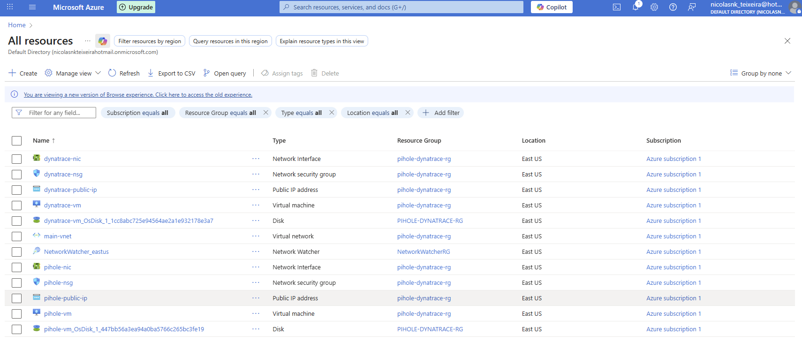
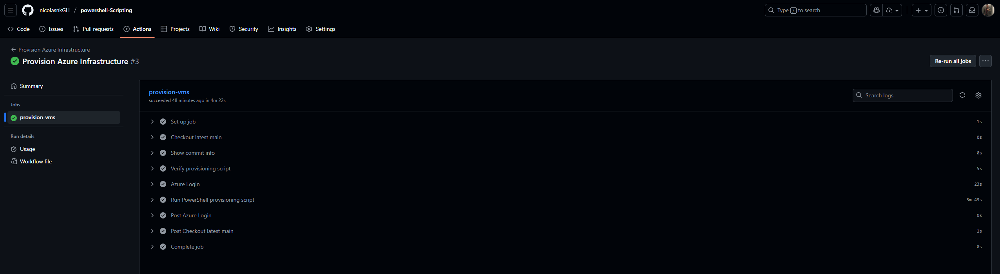
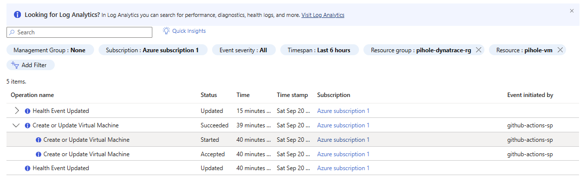

# Simple Azure VM Provisioning with GitHub Actions

## 🚀 Project Overview
This project demonstrates **Infrastructure as Code (IaC)** by provisioning Azure virtual machines using:

- **PowerShell scripts** (`Invoke-AzureProvisioning.ps1`) to run Azure CLI commands  
- **YAML workflow** (`.github/workflows/main.yaml`) to automate everything via **GitHub Actions**  

The result is a **repeatable, automated process** for creating and managing Azure infrastructure.


---

## 📂 Key Files
- **`.github/workflows/main.yaml`**  
  Defines the GitHub Actions workflow. Handles logging into Azure and running the provisioning script.  
  > You can customize VM names, resource group, and other settings directly in this file.  

- **`Invoke-AzureProvisioning.ps1`**  
  PowerShell script containing all the **Azure CLI commands** for creating resources:
  - Resource group  
  - Virtual network  
  - Network security groups  
  - Two virtual machines  

---

## ⚙️ How to Use

### 1. Configure GitHub Secrets
This workflow requires your **Azure credentials** and **SSH public key**.  
Create the following repository secrets in **Settings → Secrets → Actions**:

- `AZURE_CREDENTIALS` → Your Azure Service Principal credentials  
- `SSH_PUBLIC_KEY` → The content of your SSH public key  

---

### 2. Trigger the Workflow
1. Navigate to the **Actions** tab in your GitHub repo  
2. Select **Provision Azure Infrastructure** workflow  
3. Click **Run workflow**  

The provisioning process will begin automatically. ✅

---

## 🎛️ Customization
To customize resource names or settings, edit the **environment variables** in `.github/workflows/main.yaml`:

```yaml
name: Provision Azure Infrastructure

jobs:
  provision-vms:
    runs-on: ubuntu-latest
    env:
      AZURE_RESOURCE_GROUP: 'your-resource-group'
      AZURE_LOCATION: 'your-azure-region'
      PIHOLE_VM_NAME: 'your-pihole-vm'
      DYNATRACE_VM_NAME: 'your-dynatrace-vm'
      VM_USERNAME: 'your-username'
```
---

## ✅ Provisioning Success!
The result is a **repeatable, automated process** for creating and managing Azure infrastructure.

<p align="center">
  
  
  
</p>

---

## Notes

- This project demonstrates Infrastructure as Code (IaC) using GitHub Actions + PowerShell.
- Future enhancements will allow the workflow to prompt for inputs so you can choose whether to provision or destroy resources dynamically.
- Ideal for learning CI/CD + Azure automation in a real-world DevOps scenario.

---

## 🛠️ Roadmap / To-Do

- [x] Provision Azure VMs using GitHub Actions + PowerShell
- [x] Add screenshots to validate provisioning
- [ ] Create **Destroy-AzureResources.ps1** to tear down infrastructure
- [ ] Add script to deploy **Pi-hole** on VM1
- [ ] Add script to deploy **Dynatrace** on VM2
- [ ] Update workflows to accept **user inputs** (resource group, VM names, action: provision/destroy)
- [ ] Make scripts fully reusable without manual edits

---

